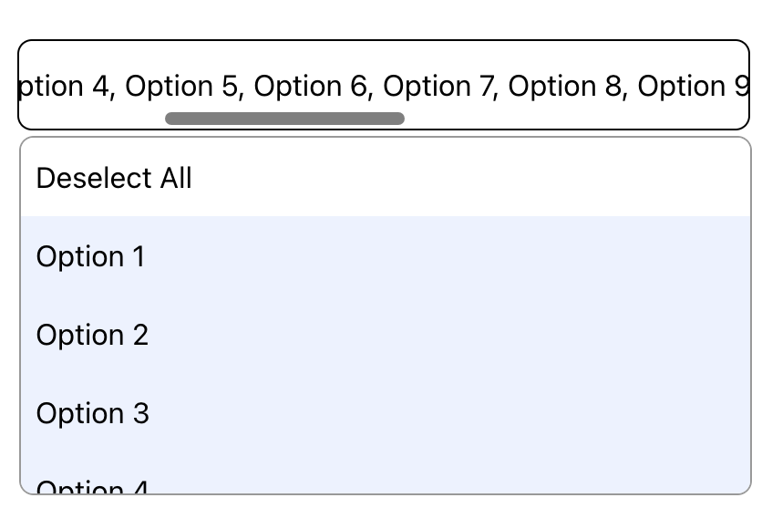

# Leo Martinez - Hive Frontend Challenge Submission

## Introduction

Here is my completed drop down menu component. I created a simple page demonstrating it in action, where there is one drop down menu next to another one. The difference between them is that one allows for multiple selection.

## How to run the project

In the project directory, you can run:

### `npm start`

This will run the app in the development mode.\
Open [http://localhost:3000](http://localhost:3000) to view it in your browser.

## Component Behavior

- To select an option, simply click on the name of the option. You can scroll down to view more options.
- To exit the drop down menu and submit the option(s), click anywhere outside of the drop down menu.
- In the multi-select menu (the menu on the right), you can select multiple options. You can also de-select any option by clicking on it again.
- Options that have already been selected will have a light blue background and will show up at the top of the menu.
- If too many options are selected and the text overflows, the user can scroll to the side and see all of the options that they have selected so far.
  

## Disclaimers

I enjoyed doing this exercise and I beleive it is a good test of skills. I kept the design simple due to the limited time. If the time limit was not in place, further design improvements could have been made such as adding icons to indicate what options have been selected or to hint to the user that the menu can expand / collapse.
